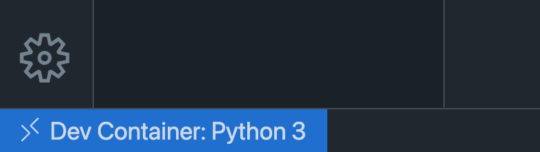

# Getting Started with Development Containers in VS Code

## Module Source link

[Use a Docker container as a development environment with Visual Studio Code](https://docs.microsoft.com/en-us/learn/modules/use-docker-container-dev-env-vs-code/?WT.mc_id=academic-55190-ornella)

# Goals 

In this workshop, you will learn how to access, customize, and add software to development containers in Visual Studio Code so that you can collaborate with ease across machines and development environments. 

| **Goal**                                          | Description                                                                                                    |
| ------------------------------------------------- | -------------------------------------------------------------------------------------------------------------- |
| **What will you learn**                           | How to load and connect to a remote project, customize settings when working with a development container, and add software to the container environment. |
| **What you'll need**                              | [Visual Studio Code](https://code.visualstudio.com?WT.mc_id=academic-55190-ornella), [Docker Desktop](https://www.docker.com/products/docker-desktop), and [Git](https://git-scm.com/downloads)                                          |
| **Duration**                                      | Roughly 1 hour |
| **Slides**                                        | [Powerpoint](slides.pptx) |   

# Video

Video coming soon...

## Pre-Learning

- [Overview of Containers and Docker](https://docs.microsoft.com/en-us/dotnet/architecture/containerized-lifecycle/introduction-to-containers-and-docker?WT.mc_id=academic-55190-ornella)
- [Introduction to Git](https://docs.microsoft.com/en-us/learn/modules/intro-to-git/?WT.mc_id=academic-55190-ornella)
- [Use a Docker container as a development environment with Visual Studio Code](https://docs.microsoft.com/en-us/learn/modules/use-docker-container-dev-env-vs-code/?WT.mc_id=academic-55190-ornella)

## Prerequisites

- [Visual Studio Code](https://code.visualstudio.com?WT.mc_id=academic-55190-ornella)
- [Docker Desktop](https://www.docker.com/products/docker-desktop)
- [Git](https://git-scm.com/downloads)

## What students will learn

Say you're working on a hackathon project with your classmates using Python, and you want to make sure that your project is compatible across multiple machines. In this workshop, you will learn how you can use development containers to work on any project without having to set up or configure your machine first.

## Prepare the project

In this section, you'll do some setup to [open a sample project](https://docs.microsoft.com/en-us/learn/modules/use-docker-container-dev-env-vs-code/2-exercise-prepare-project?WT.mc_id=academic-55190-ornella) written in Python, and install the Remote Containers extension for Visual Studio Code. 

## Use the Remote - Containers extension

Next, you'll learn how to [use the Remote - Containers extension in Visual Studio Code](https://docs.microsoft.com/en-us/learn/modules/use-docker-container-dev-env-vs-code/3-use-as-development-environment?WT.mc_id=academic-55190-ornella). You'll be able to understand how Docker and Visual Studio Code make it possible to have projects contained in their own preconfigured, containerized environments using the extension. 

## Add a dev container to an existing project

Now that you have the extension ready to go, you'll [add a dev container and open the sample project](https://docs.microsoft.com/en-us/learn/modules/use-docker-container-dev-env-vs-code/4-exercise-add-development-container?WT.mc_id=academic-55190-ornella) in the container. 

## Customize project and editor settings

After setting up the dev container for the project, you'll learn how to [customize and automate all the project setup](https://docs.microsoft.com/en-us/learn/modules/use-docker-container-dev-env-vs-code/5-customize-settings?WT.mc_id=academic-55190-ornella) using the devcontainer.json file. 

## Milestone 4

text

link

## Milestone 5

text

link

## Quiz or Code Challenge

Link to quiz or challenge on Learn

## Next steps

*links to Microsoft Learn to further learning progress, and/or a path to certifications*

## Optional Transfer Knowledge activity

*suggest, or add as an addendum, a way to extend students knowledge of the topic by creating a new app or demo that builds on the original workshop materials.*

## Feedback

Be sure to give [feedback about this workshop](https://forms.office.com/r/MdhJWMZthR)!

[Code of Conduct](CODE_OF_CONDUCT.md)

